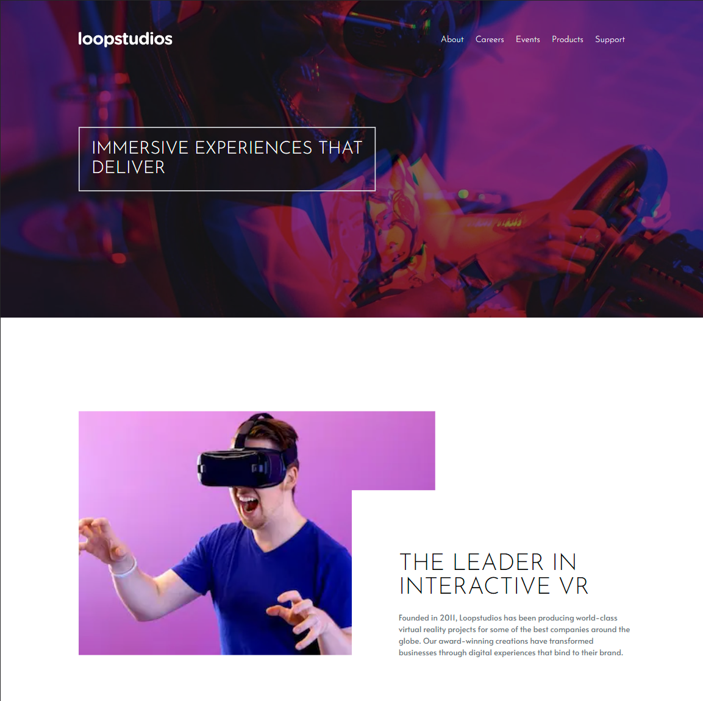

# Frontend Mentor - Loopstudios landing page

## Welcome! 👋

Thanks for checking out this front-end coding challenge.

[Frontend Mentor](https://www.frontendmentor.io) challenges help you improve your coding skills by building realistic projects.

## The challenge

Your challenge is to build out this landing page and get it looking as close to the design as possible.

This challenge focuses mostly on HTML & CSS. There's a tiny bit of JS included for the mobile navigation toggle. But you could also choose to do this without JS!

You can use any tools you like to help you complete the challenge. So if you've got something you'd like to practice, feel free to give it a go.

Your users should be able to:

- View the optimal layout for the site depending on their device's screen size
- See hover states for all interactive elements on the page

Want some support on the challenge? [Join our Slack community](https://www.frontendmentor.io/slack) and ask questions in the **#help** channel.

## Table of contents

- [Screenshot](#screenshot)
- [Links](#links)
- [My process](#my-process)
  - [Built with](#built-with)
  - [What I learned](#what-i-learned)
  - [Continued development](#continued-development)
  - [Useful resources](#useful-resources)
- [Author](#author)
- [Acknowledgments](#acknowledgments)

### Screenshot

### Links

- Solution URL: [Solution URL](https://www.frontendmentor.io/solutions/)
- Live Site URL: [Live site URL]()

## My process

- Create a new project with Next.js
- Install Tailwind Css
- Create the Order component
- Add the respective styles to get the expected result

### Built with

- Next.js
- Tailwind Css for styles
- Mobile-first workflow

### What I learned

The purpose of this project was to learn how to use Tailwind Css. I learned how to use the Tailwind Css framework to create a QR code component. I also really liked to use the Tailwind Css framework because it is very easy to use and it is very easy to create responsive components with it.

### Useful resources

- [Tailwind Css Docs](https://tailwindcss.com/docs/installation) - This helped me use the Tailwind Css framework to create the QR code component.

## Author

- Website - [Hugo Tiburcio](https://github.com/tiburciohugo)
- Frontend Mentor - [@tiburciohugo](https://www.frontendmentor.io/profile/tiburciohugo)

## Acknowledgments

Shout out to the Tailwind guys for making an awesome framework and incredible documentation.🚀
